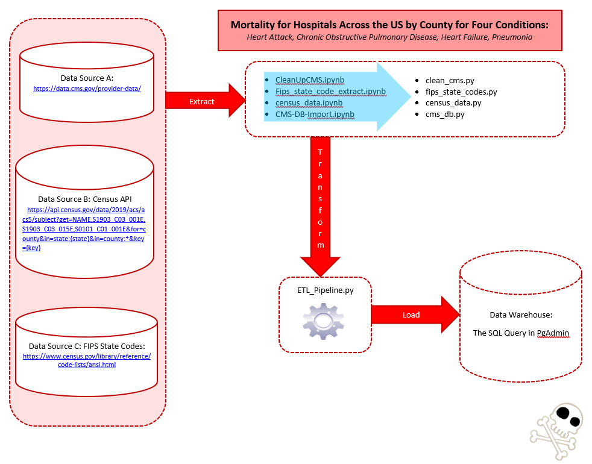
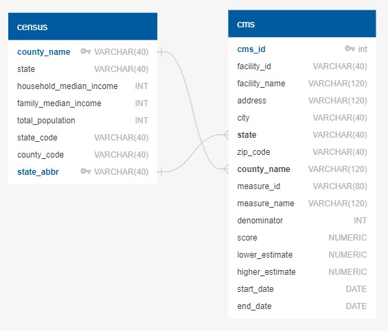
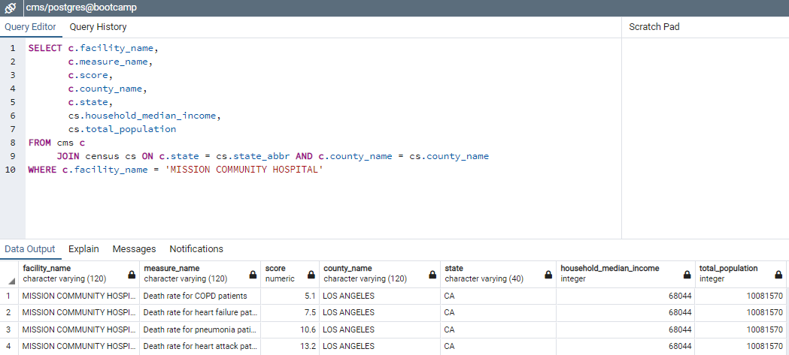

# Bootcamp-ETL-Project

## Summary

Knowing that mortality rates are at the forefront of current events, we extracted Medicare information and population data for use in
 future projects. Our goal was to familiarize ourselves with the extract, transform and load processes. 

## Data

- COPD Mortality (Chronic obstructive pulmonary disease)
- HF Mortality (Heart Failure)
- AMI Mortality (Acute Myocardial Infarction)
- PN Mortality (Pneumonia)
- Census population for United States

## Possible applications for future projects

- Compare Oregon mortality rates per capita to the rest of the nation
- Use heatmap to highlight where highest/lowest mortality rates are nationwide
- Possible filter for low average household incomes
- Compare mortality rates across McDonald's locations in the United States (specifically Big Mac consumption)

## Project process

For this project we pulled data from the CMS Data site as well as the census site. We hope to use this project as a staging and in helping to plan for the next project.

**This was our process:**

1. We explored the available data on the CMS site and decided that looking at four measures for mortality were our primary focus. This was because this data was available for almost 100% of the hospitals in the database. This extracted as a CSV.
1. We explored the data on the census site and discovered that the two datasets had aligned data for zip code, state, and county. This required the use of an API key and extracted as a CSV.
1. We scraped the table on the census site to obtain the state codes.
1. We pulled all the above-mentioned datasets into the repository.
1. From there we used Jupyter Notebooks to clean and explore the data further.
   - For the CMS data we first created a notebook to do the following:
     - Read in the CMS data
     - Only bring in the columns we wanted
     - Get rid of any null values if any but there were none.
     - Removed all instances whereupon there not a score for a measure
     - Removed all measures that were not the 4 measures we were interested in
     - Exported to a new CSV
   - For the census data we created a notebook and did the following:
     - Read in the FIPS State codes and the census data
     - Brought in the columns we wanted
     - Created a for loop to create a dataframe with data we wanted
     - Created a function to create a state abbreviation for every state
     - Changed the county names to be all caps to match the county names in the CMS dataset.
     - Exported to new csv
1. At that point we read the two CSV noted in step 5 to a new database to prepare the information for the ultimate pipeline. In this notebook we used SQL Alchemy to merge the two into one.
   - At this point there was an issue with the county names in the census and the county names in the CMS dataset so we went through and fixed those issues.
   - We then set it up to be able to create the pipeline
1. End-to-end ETL pipeline process:
   - Process and clean the fips_state_codes. 
   - Process and clean the cms data.
   - Process and clean the census data.
   - Load all the above data into the mongo database.
1. In order to recreate the data, the ERD, SQL Query and the QRY diagram were executed, as seen below:

Entity Relationship Diagram(ERD):

Example Query:

## Files

[`ETL_pipeline.py`](ETL_pipeline.py) - This is the main program for running the automated ETL pipeline. 

[`fips_state_codes.py`](fips_state_codes.py) - This package extracts and transforms the state codes as identified by the census.

[`clean_cms.py`](clean_cms.py) - This package extracts and transforms CMS mortality data.

[`census_data.py`](census_data.py) - This package extracts and transforms geographic population and income data.

[`cms_db.py`](cms_db.py) - This package does a final transformation and then loads the data into the database.

[`QuickDBD-export.sql`](DDL/QuickDBD-export.sql) - This is the database table creation script for PgAdmin.

## Execution

1. Assumption is that you have a working postgres database and that you run the database table creation script against a database of your choice.
1. Census API key needed. Must be named `api_key.py` with the value below: 
   - key = "YOUR API KEY HERE"
1. For the database configuration, you need a file named `db_info.py` with the values below:
   - db_user = "YOUR DATABASE USERNAME"
   - db_password = "YOUR DATABASE PASSWORD"
   - db_name = "YOUR DATABASE NAME" 
1. To execute the ETL pipeline, type: `python ETL_pipeline.py` at command line.

##Team

- Jenny Kaylor
- Joshua Gonzalez Williams
- Jay Hastings
- Erica Fisher
- Courtney Muhlbach

